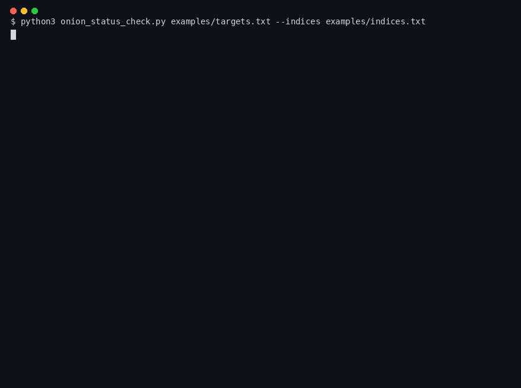
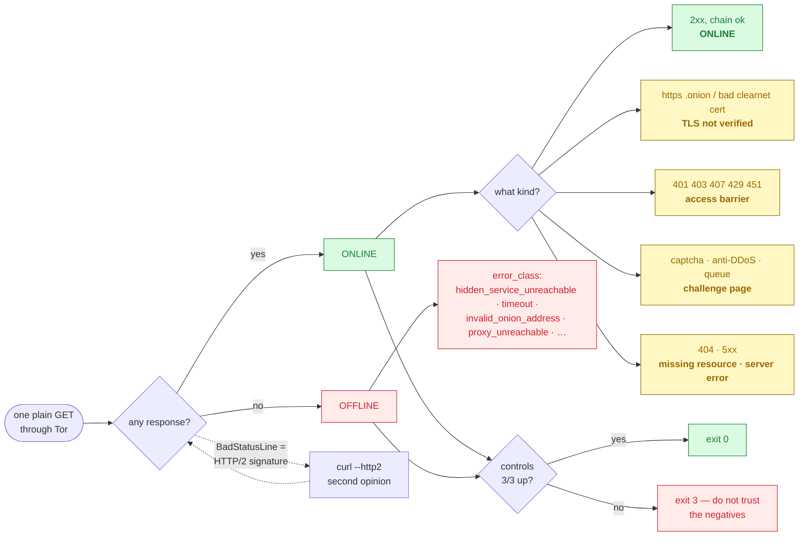
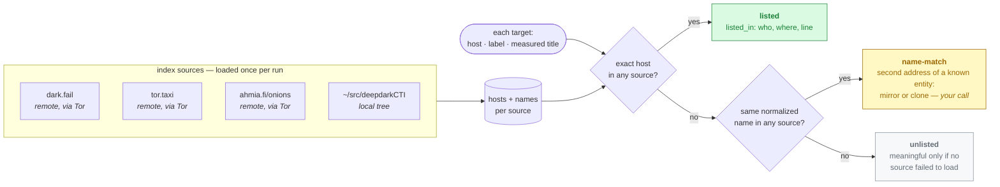
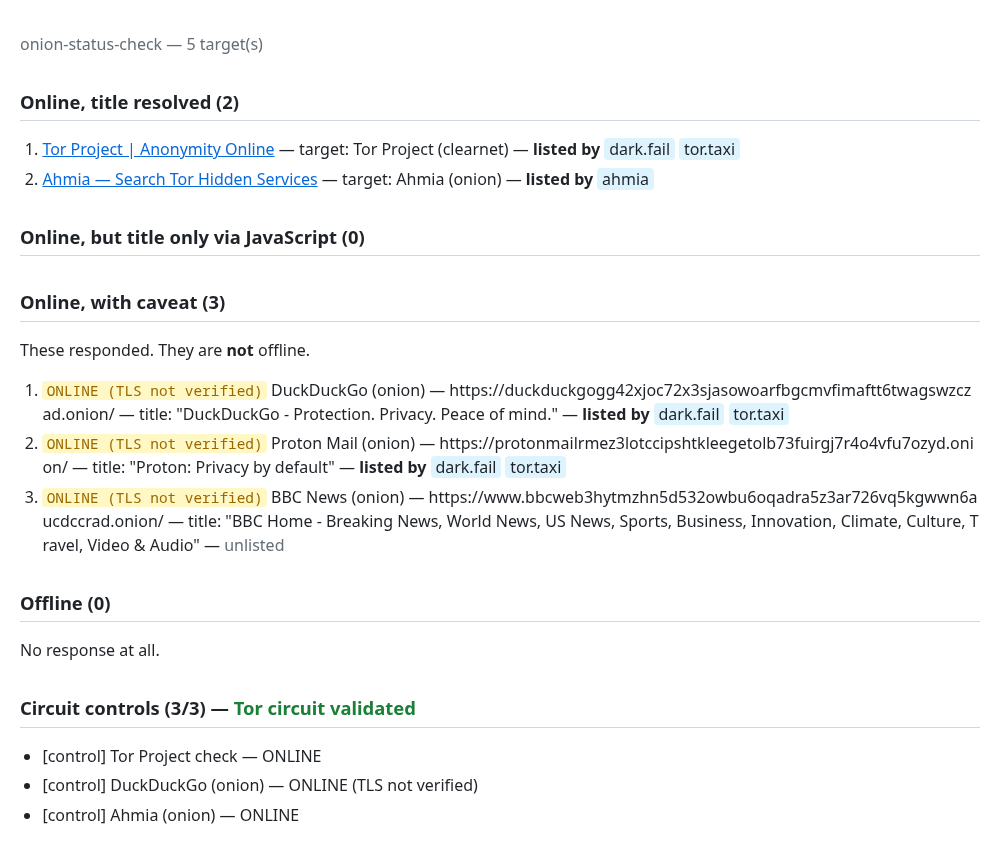

# onion-status-check

Answers two questions about a list of `.onion` (or clearnet) addresses, honestly:

1. **Is it up?** — one plain GET through Tor, status code and page title, nothing else.
2. **Who already lists it?** — cross-checked against any indices you point it at
   (dark.fail, tor.taxi, Ahmia, a catalog on disk, your own bookmarks).

It never runs JavaScript, never logs in, never crawls, and never decides for
you: it reports, with the reasons, and tells you when its own measurement
cannot be trusted.

**Status:** v0.2 — working and tested; the JSON layout may still change.

<p align="center">
  
</p>

<sub>A real run on <code>examples/targets.txt</code> (public services only), ~1 min wall-clock compressed to 20 s. Also as <a href="docs/demo.svg">SVG</a>.</sub>

---

## Quick start

You need a running Tor daemon (SOCKS5 on `127.0.0.1:9050` — on Debian or
Arch: install `tor`, then `systemctl enable --now tor`), Python 3.10+, and
`curl` on your `PATH`.

```bash
pip install -r requirements.txt
python3 onion_status_check.py examples/targets.txt
```

The example list has public services only. You should see every target
`ONLINE` (the HTTPS ones with a `TLS not verified` note), `Controls: 3/3
online`, and exit status `0`. Results land in `results/`.

**Your own list** is a text file, one target per line — `Name | URL`, or just
the URL. Lines starting with `#` are ignored.

```
# my-list.txt
Runion        | http://runionv3do7jdylpx7ufc6qkmygehsiuichjcstpj4hb2ycqrnmp67ad.onion/
Some mirror   | http://someaddressxxxxxxxxxxxxxxxxxxxxxxxxxxxxxxxxxxxxxxxxxxxxxxx.onion/
https://dark.fail/
```

---

## Reading a result

Every target ends up in one of two states, and the state comes with a reason.
This is the whole decision, per target:



**`ONLINE`** — the server answered. Any answer counts: a 403, a captcha page, a
self-signed certificate. `status_detail` says what kind of answer it was:

| `status_detail` | What it means |
|---|---|
| `ONLINE` | a normal page |
| `ONLINE (TLS not verified)` | it answered over HTTPS; the certificate chain was not checked (see *Why a naive checker lies*) |
| `ONLINE (HTTP 403 - access barrier)` | login wall, WAF or rate limiter — alive, and saying "not you" |
| `ONLINE (challenge page)` | captcha / anti-DDoS / waiting room served with a 200 |
| `ONLINE (HTTP 404 - missing resource)` | server alive, that path is not |
| `ONLINE (HTTP 5xx - server error)` | application broken, host up |
| `… [HTTP/2, measured via curl]` | the server only speaks HTTP/2; measured with the curl second opinion |

**`OFFLINE`** — nothing came back. `error_class` says why:

| `error_class` | What it means |
|---|---|
| `hidden_service_unreachable` | Tor could not reach the service — the usual "it's down" |
| `timeout` | no answer within `--timeout` |
| `invalid_onion_address` | Tor refused to even try: malformed name, bad checksum, retired v2 address |
| `proxy_unreachable` | **Tor itself is not reachable** — nothing was measured; check that Tor is running and `--proxy` is right |
| `circuit_failed`, `connection_refused_by_destination`, `host_unreachable_via_exit`, `socks_general_failure` | the SOCKS reply code, by name |
| `tls_failed_even_unverified`, `connection_refused_or_reset`, `request_error` | other failures, by kind |

**Then check the controls.** Every run ends by measuring three services that
are known to be up (Tor Project, DuckDuckGo's onion, Ahmia's onion). A batch of
negatives is far more often a broken circuit than a dead population — if the
controls fail too, the run says so in capitals and exits with `3`, and you
should not record anything as dead from it.

---

## Why a naive checker lies

The obvious version of this tool — *"anything that isn't a clean 200 is
dead"* — produces false OFFLINE verdicts in four different ways, and they all
look the same in a summary count. This tool exists to tell them apart.

| The naive checker sees… | …when actually | This tool says |
|---|---|---|
| a TLS error | a `.onion` address *is* the public key; CA-signed certificates there are rare, so verification "fails" on healthy sites | `ONLINE (TLS not verified)` |
| a 403 or 429 | a WAF, a login wall or a rate limiter — a living server refusing *you* | `ONLINE (HTTP 403 - access barrier)` |
| a 200 with an empty or "Loading…" title | a captcha or anti-DDoS wall, often an HTML fragment with no `<title>` at all | `ONLINE (challenge page)` |
| a broken response (`BadStatusLine`) | the server only speaks HTTP/2 and Python's `requests` only speaks HTTP/1.1 | `ONLINE [HTTP/2, measured via curl]` |

About `TLS not verified`: for `.onion` targets chain checking is off **by
policy**, so the label states what the tool did — not that the certificate is
bad. On clearnet the chain *is* verified, and only retried unverified when the
handshake fails; a clearnet `TLS not verified` therefore means "alive, but the
certificate did not validate".

---

## Who lists it — index cross-check

Once you know an address is up, the next question is whether anyone reputable
already lists it. A curated index that publishes the exact address (dark.fail
and tor.taxi verify theirs with PGP) is the cheapest strong corroboration there
is. A source that lists the same *name* with a *different* address tells you
you are looking at a second address of a known entity — a mirror, or a
phishing clone.

Sources go in a text file, one per line. `examples/indices.txt` ships with
three; add whatever lists addresses — a crawler's public list, a blog post, a
saved forum thread, a markdown catalog like
[deepdarkCTI](https://github.com/fastfire/deepdarkCTI), your own notes:

```
# indices.txt
dark.fail   | https://dark.fail/
tor.taxi    | https://tor.taxi/
ahmia       | https://ahmia.fi/onions/
my catalog  | ~/src/deepdarkCTI
```

Remote sources are fetched **once per run**, through the same Tor proxy as
everything else. Local paths (a file or a whole directory tree) are read from
disk. `--catalog PATH` is a shortcut for one local source.



```bash
# triage a list before spending a second of Tor time on the targets
python3 onion_status_check.py new-links.txt --indices examples/indices.txt --indices-only

# measure and cross-check in one run
python3 onion_status_check.py new-links.txt --indices examples/indices.txt --catalog ~/src/deepdarkCTI
```

Each record gains an `indices` block with a verdict and the evidence:

| `verdict` | What it means |
|---|---|
| `listed` | the exact host is in at least one source — `listed_in` says which, with the line |
| `name-match` | the host is not, but an entry with the same name is — `name_matches` says which. Mirror or clone? **That decision is yours.** |
| `unlisted` | neither — and only meaningful if `sources_failed` is empty |

**Two things to keep in mind.** *Listed* means different things for different
sources: on tor.taxi it means "official address, PGP-verified"; on Ahmia it
means "exists and was crawled", nothing more — the record tells you *who*, the
weighing is yours. And a source that could not be loaded (unreachable, HTTP
error, or a page that came back with no addresses in it because its format
changed) is reported as failed and makes the exit status `3`: an `unlisted`
from a run with a failed source is not a result.

<details>
<summary><b>How name matching works</b> (click to expand)</summary>

Names are lowercased, stripped of kind-words (`market`, `forum`, `(Deep)`,
`mirror`, `blog`, …) and punctuation, and plurals are folded (`LEAK FORUMS`
meets `Leak Forum`). Two names then match only if they are **equal** after
that, or if every meaningful word of the shorter one is a whole word of the
longer one — with at least two such words, or a single word of seven or more
letters (`lockbit`, `atomsilo`).

Substring containment is never used: `trustmarket` contains `stmarket`, and a
long page title contains all sorts of listed words. Generic words — `search`,
`hidden`, `wiki`, `links`, `carding`, `exploit`, `darknet`, nationalities — never
carry a match on their own. Only the **first segment** of a label or title is
compared (`Nexus Market - Escrow Marketplace` → `Nexus Market`), because that
is where a site's own name lives; a title that does not carry the name cannot
match, and the tool will not guess.

Markdown links, HTML anchors and bare v3 addresses (labeled by the text on
their line) are all indexed. `.git` directories are skipped and a malformed
URL is ignored rather than aborting the load.

Measured on a real batch of 1,038 addresses against a 1,300-entry catalog:
80 name-matches on 44 distinct names, 41 of them genuine second addresses of
a listed entity, in 0.5 s of matching.
</details>

---

## What it will never do

- **Run JavaScript.** Rendering unknown dark-web pages is a different risk
  category and has been used for deanonymization. When a title looks like a
  placeholder (*Loading…*, *Just a moment…*), the tool takes a second, purely
  static look at the HTML it already has — `og:title`, `twitter:title`, API
  endpoint hints — and otherwise flags the entry `needs_js_rendering` and
  lists it separately.
- **Retry blindly.** The `curl --http2` second opinion fires only when the
  failure has the HTTP/2 signature. On any other failure curl would use the
  same Tor daemon and fail the same way, doubling the cost of every dead
  target for nothing.
- **Run in parallel.** One request at a time, with a random 2–5 s pause. This
  is a measurement tool, not a scanner.
- **Stand out.** It sends Tor Browser's own User-Agent (currently Tor Browser
  15 / Firefox ESR 140), the string every Tor Browser sends by design. When a
  new Tor Browser major ships, `TOR_BROWSER_UA` needs the bump, or the
  requests start looking like the previous generation.

---

## Reference

### Options

| Option | Default | Notes |
|---|---|---|
| `--out-dir DIR` | `results` | where the JSON/HTML files go |
| `--proxy URL` | `socks5h://127.0.0.1:9050` | keep the `h` — it makes Tor resolve `.onion` names |
| `--timeout SECONDS` | `25` | per request |
| `--delay MIN MAX` | `2 5` | random pause between requests, in seconds |
| `--no-controls` | off | skip the circuit controls — not recommended |
| `--no-html` | off | write JSON only |
| `--indices FILE` | — | sources list, one per line `Name \| URL-or-path` |
| `--catalog PATH …` | — | add a local file or tree as an index source |
| `--indices-only` | off | cross-check only; measure no target |

### Files

```
results/<list>-<YYYYmmdd-HHMM>.json            one object per target
results/<list>-<YYYYmmdd-HHMM>-controls.json   the control targets
results/<list>-<YYYYmmdd-HHMM>.html            human-readable report
results/<list>-indices-<YYYYmmdd-HHMM>.json    with --indices-only
```

Nothing is ever overwritten: a second run in the same minute gets a `-2`
suffix. File names use local time; `checked_at` inside the records is UTC.

The HTML report groups targets by what happened to them and carries the
index verdicts inline:

<p align="center"></p>

### Fields

Every record: `name`, `uri`, `checked_at`, `status`, `status_detail`,
`http_code` (`null` when OFFLINE).

ONLINE records add `content_type` (as sent by the server), `title`,
`title_source`, `tls_unverified`, `final_url`, `needs_js_rendering`, and —
only when the title looked like a placeholder — `static_hints`
(`meta_title`, `meta_description`, `api_hints`, `spa_state_markers`,
`script_srcs`; reported, never fetched).

`title_source` is one of `html_title`, `meta_tag` (the `<title>` was a
placeholder and `og:title`/`twitter:title` was used), `html_title_placeholder`
(nothing better found), `not_html` (JSON or plain text — no title expected),
`challenge_page`. The server's `Content-Type` decides what counts as HTML; the
body is sniffed only when there is no header.

OFFLINE records add `error_class` and a truncated `error` string.

With `--indices` or `--catalog`, every record also carries `indices`:
`verdict`, `listed_in`, `name_matches` (each entry: `source`, `name`, `host`,
`where`, `line`), `sources_failed`.

### Exit status

| Code | Meaning |
|---|---|
| `0` | run completed and can be trusted |
| `3` | run completed, but **do not trust its negatives**: a control target failed (circuit suspect) or an index source failed to load |
| `2` | usage error |

Anything else is a crash. Scripts and cron jobs should treat any non-zero as
"do not record this run".

### Tests

```bash
python3 -m unittest discover -s tests -v
```

Offline, no Tor needed. They pin the behaviour that makes this tool different
from a naive checker — including error classification against the real error
strings PySocks produces, the HTTP/2 branch, challenge and placeholder
handling, index matching and its known false positives.

### Regenerating the demo

`docs/demo.gif` and `docs/demo.svg` are rendered from a real transcript by
`docs/make_demo.py` (Pillow only); `docs/report.png` is a headless-Chromium
screenshot of the HTML report from the same run. Both use
`examples/targets.txt` — public services only — so nothing in the images is
anyone's private list.

---

MIT — see `LICENSE`.
