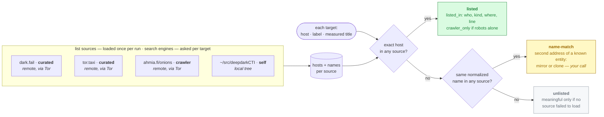

# Who lists it — the index cross-check

Once you know an address is up, the next question is whether anyone reputable
already lists it. This page is the full reference for the cross-check: the
registry, the kinds, your own sources, search engines, and the `indices`
maintenance command. For the one-paragraph idea, see the
[README](../README.md#who-lists-it).

A curated index that publishes the exact address (dark.fail and tor.taxi verify
theirs with PGP) is the cheapest strong corroboration there is. A source that
lists the same *name* with a *different* address tells you you are looking at a
second address of a known entity — a mirror, or a phishing clone.

## The registry

The project ships a curated registry of public indices in
[`indices/sources.txt`](../indices/sources.txt) — `--registry` uses it. Every
entry has a card in [`indices/SOURCES.md`](../indices/SOURCES.md) saying what the
source is, who runs it, how it decides what to list, and therefore what "listed
by it" is worth; every entry carries a **kind**:

| kind | "listed by" means | in the registry |
|---|---|---|
| `curated` | a person verified the identity behind the address (PGP, ownership proof) | dark.fail, tor.taxi |
| `crawler` | a robot reached the address once — nothing about identity | Ahmia |
| `institutional` | the operator itself publishes the address | Tor Project's own services, SecureDrop directory |
| `tracker` | a thematic tracker maintains it | OGransomwatch (ransomware leak sites) |
| `community` | curated by pull request, one maintainer reviewing | real-world-onion-sites, Wikipedia's list, deepdarkCTI |
| `search` | a search engine **queried per target** with the address — crawler-grade evidence | OnionLand Search |
| `research` | a published measurement dataset; what an entry proves is what the study measured — the card says | KAU's Onion-Location measurements, onionsec.csv |
| `self` | your own catalog or bookmarks | whatever you pass with `--catalog` |
| `warning` | a list of **known-bad** addresses (clones, scam mirrors) — a hit is an **alert**, not corroboration | add your own; it goes stale fast |

The registry is the part of this project that grows by contribution: one line and
one card per source, by pull request. The bar — an index enumerates addresses,
has an operator that can be named, and loads with a plain GET — is in
[`CONTRIBUTING.md`](../CONTRIBUTING.md), and it is what keeps a "hidden wiki"
clone from laundering scam mirrors into *listed*.

## Your own sources

Your own sources go in a text file of the same shape, one per line
(`examples/indices.txt` is a template) — a saved page, a blog post, a markdown
catalog, your notes:

```
# my-sources.txt            Name | URL-or-path | kind
my bookmarks  | ~/notes/onions.md   | self
team catalog  | ../deepdarkCTI      | community
```

List sources are fetched **once per run**, through the same Tor proxy as
everything else, one after another with the usual pause; a search source (below)
is asked once per target instead. Local paths (a file or a whole directory tree)
are read from disk, relative to the sources file. `--catalog PATH` is a shortcut
for one local source of kind `self`. `--registry`, `--indices` and `--catalog`
combine.



```bash
# triage a list before spending a second of Tor time on the targets
python3 nullius.py new-links.txt --registry --indices-only

# measure and cross-check in one run, against the registry and your own catalog
python3 nullius.py new-links.txt --registry --catalog ~/src/deepdarkCTI
```

Each record gains an `indices` block with a verdict and the evidence:

| `verdict` | What it means |
|---|---|
| `listed` | the exact host is in at least one source — `listed_in` says which (source, kind, line); `listed_kinds` summarizes the kinds |
| `name-match` | the host is not, but an entry with the same name is — `name_matches` says which. Mirror or clone? **That decision is yours.** |
| `unlisted` | neither — and only meaningful if `sources_failed` is empty |

Independently of the verdict, **`flagged`** (with `flagged_by`) is set when the
address is on a `warning` source — a clone or scam-mirror list. A flag is an
alert: shown in red and at the top of the run, and it never counts as `listed`.

**Two things to keep in mind.** *Listed* means different things for different
kinds: `listed by tor.taxi (curated)` is an identity claim; `listed by ahmia
(crawler)` means "was reachable once", nothing more. A target listed **only by
robots** — crawler lists and search engines — is flagged `crawler_only` in the
record, in the terminal summary and in the report — on a real batch of 1,038
addresses, that is exactly where 33 market "mirrors" with identical titles sat:
reachable, in no curated index, a scam template. And a source that could not be
loaded (unreachable, HTTP error, or a page that came back with no addresses in it
because its format changed) is reported as failed and makes the exit status `3`:
an `unlisted` from a run with a failed source is not a result.

## Search engines — queried per target

Most onion search engines have no list to download; they answer one address at a
time. A source whose URL contains `{query}` is that kind of source: for every
target the tool asks the engine about the target's host and reads the result page
— and only the **links** on it count, because the query is echoed in the page
text and in the pagination links, and an echo is not a result. A link to another
site counts by its host; a link back into the engine (a redirect) counts only
when the address appears in it with its scheme, which a pagination link never has.

```
# in a sources file — kind "search" and {query} go together; the URL must be remote
Some engine | http://<its address>.onion/search?q={query} | search
```

Three honest caveats. It costs **one request per target per engine**, with the
same pause as everything else, so a long list gets longer. A query **tells the
engine which address you are interested in**; downloading a list tells it nothing
— through Tor the engine does not learn who asked, but it learns what. And what
counts as a result is deliberately narrow — a link to the address, or the address
written out with its scheme next to an opaque result link — so an engine with yet
another shape produces false negatives, never false positives.

An answer that is not a results page is a **failure, not "nothing listed"**: an
error, a redirect away from the query (to the home page, a captcha, a "use our
onion" notice — Ahmia does exactly this for a query without its per-session form
token), or a page with no links at all. A failed query puts the engine in that
record's `sources_failed`; an engine that has answered nothing after three failed
queries is not asked again in that run, and an engine that answered no query at
all is a failed source (exit `3`). The registry ships one engine, OnionLand;
every other candidate was probed through Tor and its card in `SOURCES.md` says
why it is not there.

## Checking the sources themselves

Indices die and change layout. `nullius indices --registry` measures the circuit
controls first — a batch of `FAILED` sources is far more often the circuit than
the sources, and a check taken through a broken path records nothing — then loads
every source once and reports what each yields against the last known count in
`indices/sources-health.json`; a search engine is probed instead — asked about
the onion control targets, which every index knows (except itself) — and passes
when at least one comes back and **no probe fails**: the probe tests the
mechanism, not the engine's coverage. Something back but a probe failed is
`PARTIAL`:

```
source                         kind           hosts  names  status
dark.fail                      curated           36      6  OK: 36 hosts (+0% vs 2026-09-15)
Ahmia                          crawler         9025      0  OK: 9025 hosts (+0% vs 2026-09-15)
some-list                      community         12      9  CHANGED: 800 -> 12 hosts (-98%) — page format changed?
another                        curated            0      0  FAILED: HTTP 404
```

A failed control, `FAILED`, `EMPTY`, `PARTIAL`, `CHANGED` (moved by more than
half), an unknown kind, or a `{query}` URL that is not kind `search` (and vice
versa — such a source is never fetched) make the exit status `3`; `--update`
writes the current counts back (only with the controls green), and a source that
did not pass keeps its last known entry. Works on your own file too: `nullius
indices --indices my-sources.txt`.

<details>
<summary><b>How name matching works</b> (click to expand)</summary>

Names are lowercased, stripped of kind-words (`market`, `forum`, `(Deep)`,
`mirror`, `blog`, …) and punctuation, and plurals are folded (`LEAK FORUMS` meets
`Leak Forum`). Two names then match only if they are **equal** after that, or if
every meaningful word of the shorter one is a whole word of the longer one — with
at least two such words, or a single word of seven or more letters (`lockbit`,
`atomsilo`).

Substring containment is never used: `trustmarket` contains `stmarket`, and a
long page title contains all sorts of listed words. Generic words — `search`,
`hidden`, `wiki`, `links`, `carding`, `exploit`, `darknet`, nationalities — never
carry a match on their own. Only the **first segment** of a label or title is
compared (`Nexus Market - Escrow Marketplace` → `Nexus Market`), because that is
where a site's own name lives; a title that does not carry the name cannot match,
and the tool will not guess.

Markdown links, HTML anchors and bare v3 addresses (labeled by the text on their
line) are all indexed. `.git` directories are skipped and a malformed URL is
ignored rather than aborting the load.

Measured on a real batch of 1,038 addresses against a 1,300-entry catalog: 80
name-matches on 44 distinct names, 41 of them genuine second addresses of a listed
entity, in 0.5 s of matching.

</details>
</content>
