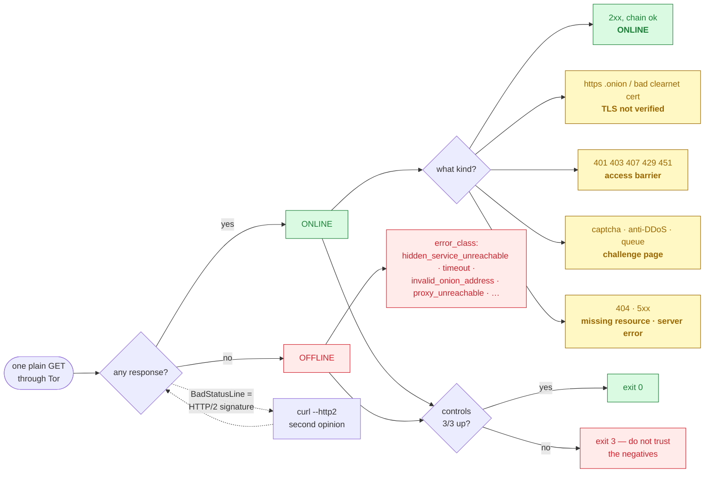

# Reference

Complete reference for `nullius`: how to read a result, every option, the file
layout, the JSON fields and the exit codes. For the *why* behind the design, see
the [README](../README.md).

- [Reading a result](#reading-a-result)
- [Options](#options)
- [Subcommands](#subcommands)
- [Files](#files)
- [The HTML report](#the-html-report)
- [Fields](#fields)
- [Exit status](#exit-status)
- [Tests](#tests)
- [Regenerating the demo](#regenerating-the-demo)

---

## Reading a result

Every target ends up in one of two states, and the state comes with a reason (a
third, `EXCLUDED`, exists only with the [stop rule](guides/long-lists.md)). This is
the whole decision, per target:



**`ONLINE`** — the server answered. Any answer counts: a 403, a captcha page, a
self-signed certificate. `status_detail` says what kind of answer it was:

| `status_detail` | What it means |
|---|---|
| `ONLINE` | a normal page |
| `ONLINE (TLS not verified)` | it answered over HTTPS; the certificate chain was not checked (see *[Why a naive checker lies](../README.md#why-a-naive-checker-lies)*) |
| `ONLINE (HTTP 403 - access barrier)` | login wall, WAF or rate limiter — alive, and saying "not you" |
| `ONLINE (challenge page)` | captcha / anti-DDoS / waiting room served with a 200 |
| `ONLINE (HTTP 404 - missing resource)` | server alive, that path is not |
| `ONLINE (HTTP 5xx - server error)` | application broken, host up |
| `… [HTTP/2, measured via curl]` | the server only speaks HTTP/2; measured with the curl second opinion |

**`OFFLINE`** — nothing came back. `error_class` says why:

| `error_class` | What it means |
|---|---|
| `hidden_service_unreachable` | Tor could not reach the service — the usual "it's down" |
| `timeout` | no answer within `--timeout` |
| `invalid_onion_address` | Tor refused to even try: malformed name, bad checksum, retired v2 address |
| `proxy_unreachable` | **Tor itself is not reachable** — nothing was measured; check that Tor is running and `--proxy` is right |
| `circuit_failed`, `connection_refused_by_destination`, `host_unreachable_via_exit`, `socks_general_failure` | the SOCKS reply code, by name |
| `tls_failed_even_unverified`, `connection_refused_or_reset`, `request_error` | other failures, by kind |

**Then check the controls.** Every run ends by measuring three services that are
known to be up (the Tor Project's check service, the BBC News onion, and Ahmia's
onion). A batch of negatives is far more often a broken circuit than a dead
population — if the controls fail too, the run says so in capitals and exits with
`3`, and you should not record anything as dead from it.

---

## Options

| Option | Default | Notes |
|---|---|---|
| `--out-dir DIR` | `results` | where the JSON/HTML files go |
| `--proxy URL` | `socks5h://127.0.0.1:9050` | keep the `h` — it makes Tor resolve `.onion` names |
| `--timeout SECONDS` | `25` | per request |
| `--delay MIN MAX` | `2 5` | random pause between requests, in seconds |
| `--no-controls` | off | skip the circuit controls — not recommended |
| `--no-html` | off | write JSON only |
| `--indices FILE` | — | sources list, one per line `Name \| URL-or-path \| kind` |
| `--registry` | off | also use the registry shipped with the project (`indices/sources.txt`) |
| `--catalog PATH …` | — | add a local file or tree as an index source of kind `self` |
| `--indices-only` | off | cross-check only; measure no target |
| `--diff-previous` | off | after the run, compare with the most recent earlier run of the same list in `--out-dir`; writes `<base>-diff.json` |
| `--journal FILE` | — | append every record as measured; relaunch skips what is there |
| `--controls-every N` | 0 | controls at the start, after every N targets and at the end; a failed checkpoint stops the run |
| `--stop-terms FILE` | — | `"name \| regex"` (or bare regex) per line; a matching label, title or meta text makes the target `EXCLUDED`, recording the rule name |
| `--exclusions FILE` | — | do-not-fetch list, read before the run and appended on every exclusion |
| `--categories FILE` | — | topic tags for each ONLINE page from a "tag then regex" lexicon; only tag names are kept, never page text |
| `--descriptor` | off | for every OFFLINE `.onion`, ask the Tor control port whether its descriptor is published (needs `stem`) |
| `--control-port PORT` | 9051 | Tor control port; Tor Browser's tor listens on 9151 |
| `--control-socket PATH` | — | Tor control socket, instead of a port |
| `--descriptor-timeout S` | 60 | per lookup; the first one of a run may need most of it |
| `--version` | — | print the version and exit |

## Subcommands

`diff OLD.json NEW.json [--json PATH]` compares two result files — see
[What changed since last time](guides/diff.md).

`indices [--registry] [--indices FILE] [--update] [--no-controls]` checks the
index sources themselves — see [Who lists it](indices.md#checking-the-sources-themselves).

---

## Files

```
results/<list>-<YYYYmmdd-HHMM>.json            one object per target
results/<list>-<YYYYmmdd-HHMM>-controls.json   the control targets
results/<list>-<YYYYmmdd-HHMM>.html            human-readable report
results/<list>-indices-<YYYYmmdd-HHMM>.json    with --indices-only
results/<list>-<YYYYmmdd-HHMM>-diff.json       with --diff-previous
indices/sources.txt                            the registry (Name | URL | kind)
indices/SOURCES.md                             one card per source
indices/sources-health.json                    last known counts, written by `indices --update`
```

Nothing is ever overwritten: a second run in the same minute gets a `-2` suffix.
File names use local time; `checked_at` inside the records is UTC.

## The HTML report

The HTML report groups targets by what happened to them and carries the index
verdicts inline:

<p align="center"></p>

---

## Fields

Every record: `name`, `uri`, `checked_at`, `status`, `status_detail`,
`http_code` (`null` when OFFLINE).

ONLINE records add `content_type` (as sent by the server), `title`,
`title_source`, `tls_unverified`, `final_url`, `needs_js_rendering`, and — only
when the title looked like a placeholder — `static_hints` (`meta_title`,
`meta_description`, `api_hints`, `spa_state_markers`, `script_srcs`; reported,
never fetched).

`title_source` is one of `html_title`, `meta_tag` (the `<title>` was a
placeholder and `og:title`/`twitter:title` was used), `html_title_placeholder`
(nothing better found), `not_html` (JSON or plain text — no title expected),
`challenge_page`. The server's `Content-Type` decides what counts as HTML; the
body is sniffed only when there is no header.

OFFLINE records add `error_class` and a truncated `error` string; with
`--descriptor`, OFFLINE `.onion` records add `descriptor` (`published`,
`not_published`, `unknown`) and `descriptor_detail`.

EXCLUDED records (stop rule) carry only `name`, `uri`, `checked_at`, `status`,
`status_detail`, `http_code: null`, `title: null` and — when a term matched —
`stop_term` and `stop_where` (`label`, `title` or `meta`).

Control records add `checkpoint` (`start`, `after N`, `end`).

A journal is the same records, one per line, plus checkpoint lines:
`{"checkpoint": "after 250", "online": 3, "total": 3, "at": "<UTC>"}`.

With `--registry`, `--indices` or `--catalog`, every record also carries
`indices`: `verdict`, `listed_in`, `name_matches` (each entry: `source`, `kind`,
`name`, `host`, `where`, `line` — `0` for a search result), `listed_kinds`
(sorted, unique), `crawler_only` (listed only by `crawler` / `search` sources),
`sources_failed` (the run's failed sources, plus any search engine whose query
for *this* target failed).

A diff file: `old` and `new` (`file`, `checked_at`, `targets`, `controls` as
`{online, total}` or `null`), `old_suspect`, `new_suspect`, the buckets
`went_offline`, `came_back`, `changed` (each with its `changes`: `field`, `old`,
`new`), `added`, `removed`, a `summary` of counts and `differences`, their total.

---

## Exit status

| Code | Meaning |
|---|---|
| `0` | run completed and can be trusted — for `diff`: no differences |
| `1` | `diff` only: differences found, both runs trustworthy |
| `3` | run completed, but **do not trust its negatives**: a control target failed (circuit suspect) or an index source failed to load; with `--controls-every`, the run stopped at a failed checkpoint — for `diff`: differences found, but one side's controls failed — for `indices`: a control failed, or a source failed, came back empty, passed only part of its probe, moved by more than half, or has an unknown kind |
| `2` | usage error |

Anything else is a crash. Scripts and cron jobs should treat any non-zero from a
run as "do not record this run"; for `diff`, `1` is the signal worth acting on
and `3` is the one worth reading first.

---

## Tests

```bash
python3 -m unittest discover -s tests -v
```

Offline, no Tor needed. They pin the behaviour that makes this tool different
from a naive checker — including error classification against the real error
strings PySocks produces, the HTTP/2 branch, challenge and placeholder handling,
index matching and its known false positives.

## Regenerating the demo

`docs/demo.gif` and `docs/demo.svg` are rendered from a real transcript by
`docs/make_demo.py` (Pillow only); `docs/report.png` is a headless-Chromium
screenshot of the HTML report from the same run. Both use `examples/targets.txt`
— public services only — so nothing in the images is anyone's private list.
</content>
